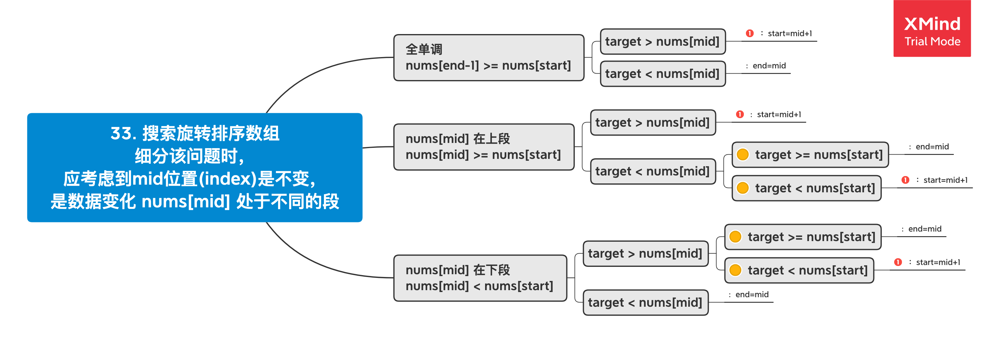

# 寻找一个半有序数组中间无序的地方
## 边界条件
len > 1 && 是否是半有序的 
## 终止条件
被查区间类只有一个元素了
## 在上段就修改start
## 在下段就修改end
## 如果最后查找的位置为在上段，返回值加1

# 33. 搜索旋转排序数组
细分该问题时，
应考虑到mid位置(index)是不变，
是数据变化 nums[mid] 处于不同的段  
第一层分析单调性  
第二层分析target的预期区间
## 全单调
nums[end-1] >= nums[start]

### target > nums[mid]

- ：start=mid+1

### target < nums[mid]

- :  end=mid

## nums[mid] 在上段
nums[mid] >= nums[start]

### target > nums[mid]

- :  start=mid+1

### target < nums[mid]

- target >= nums[start]

	- :  end=mid

- target < nums[start]

	- ：start=mid+1

## nums[mid] 在下段
nums[mid] < nums[start]

### target > nums[mid]

- target >= nums[start]

	- :  end=mid

- target < nums[start]

	- ：start=mid+1

### target < nums[mid]

- :  end=mid

 

