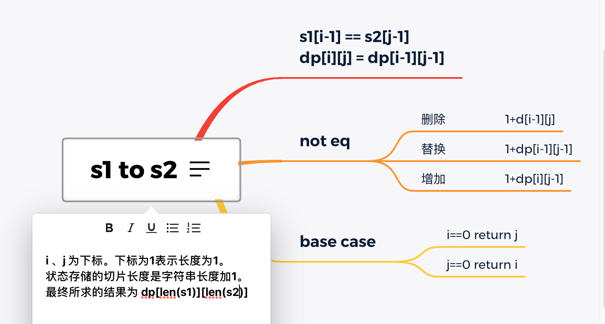

# 387. 字符串中的第一个唯一字符

复习了 使用map

# 300. 最长上升子序列

- 使用动态规划的方法
- 先将问题转化为 【以结束每个节点对应的最长子序列问题】，最后求整个数组的最长子序列【取每个节点对应的最大值】
- 初始化dp[i] = 1; 循环遍历前面i-1个节点，如果dp[j]+1 > dp[i],则 dp[i] = dp[j]+1

# 72. 编辑距离

- 动态规划
- 递归的方法 f(i,j) ；`一定要记得缓存，避免重复计算`
  -  f(i-1,j-1) : s1[i-1] == s2[j-1]【第i个字符和第j个字符相等】
  -  1+min( f(i-1,j-1) , f(i,j-1) , f(i-1,j)) 对应 替换、增加、删除 字符。

